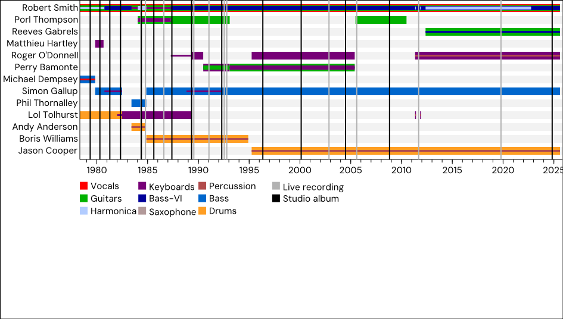
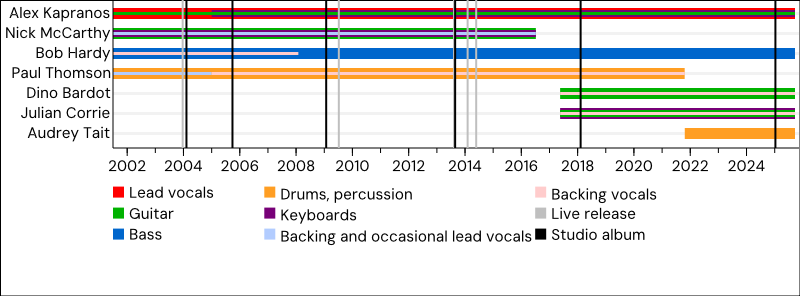
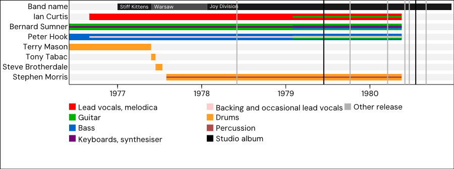
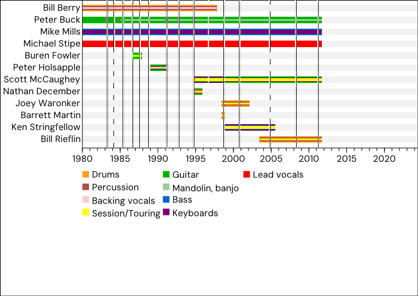

# Timelines

Wikipedia has cool timelines for organizations, like bands. For an example, see https://en.wikipedia.org/wiki/Joy_Division#Timeline

The format for this is defined in the specification described at https://en.wikipedia.org/wiki/Help:EasyTimeline_syntax

The code here cannot parse everything as defined in the specification, but it can parse enough to get something useful from files of this type.

# Examples

The data files in `/examples` are copied directly from Wikipedia. The graphics are generated by the code here.









# Installation and execution

1. Install a version of Go at or greater than 1.25.0 from https://go.dev/
1. Clone this repository
1. Run the program with the command
   ```
   go run cmd/main.go /path/to/data/file
   ```
1. To see the options, run:
   ```
   go run cmd/main.go --help
   ```
   for example, you can produce `the_cure.png` (as shown above) with the command:
   ```
   go run cmd/main.go -o the_cure.png ./examples/the_cure.data
   ```
